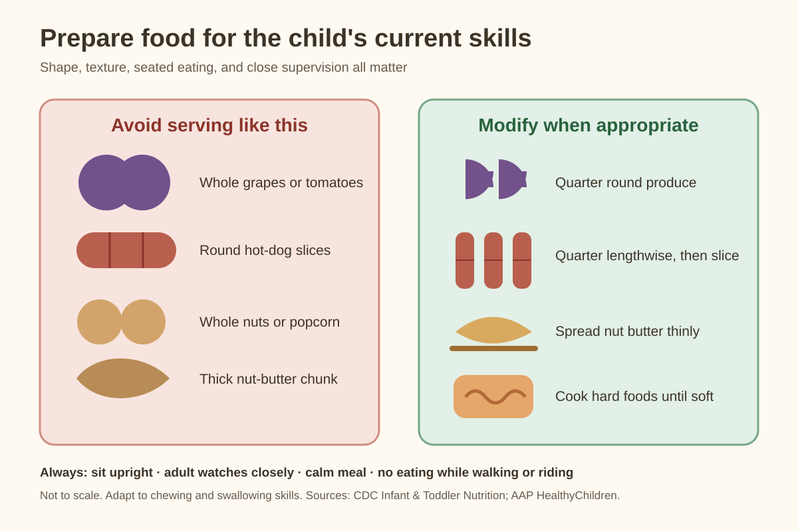

# Evidence-Based Toddler Parenting Toolkit

A practical parenting library for **12–24 months**, combining responsive caregiving, playful learning, health and safety reminders, developmental monitoring, and editable family records.

This toolkit is reusable for any family. It also includes an anonymized example for **QIQI (奇奇)**, a very active toddler who attends weekday daycare and especially enjoys books, painting, water, and movement. The example shows how to adapt a general plan without publishing a child's real name.

## Start here

1. Copy the [family profile](templates/family-profile.md) and add your child's routines, interests, languages, and care context.
2. Open the plan for your child's current month, beginning with [12 months](months/12-months.md).
3. Use the [flexible daily rhythm](guides/routine.md), adapting it for home care, daycare, relatives, or another caregiver.
4. Review the [play-space safety guide](guides/playroom.md) and [illustrated food guide](guides/food-safety.md).
5. See the [QIQI example profile](examples/qiqi-profile.md) for one customized version.
6. Keep personal observations in copies of the [templates](templates/README.md), preferably in the ignored `private/` folder.

Success means shared enjoyment, chances to explore, and a caregiver who responds. Finishing activities or reaching skills early is not the goal. No plan can guarantee a particular personality or lifelong health.

## Visual quick references

These original diagrams summarize cited guidance; they are not diagnostic tools, exact-size templates, or substitutes for the linked official CDC examples. See [visual guide notes](guides/visual-guides.md).

Every [monthly plan](months/) also includes an original activity-card illustration tied to that month's theme and the cited evidence. See [Monthly activity cards](guides/visual-guides.md#monthly-activity-cards).

## Monthly plans

[12 months](months/12-months.md) · [13 months](months/13-months.md) · [14 months](months/14-months.md) · [15 months](months/15-months.md) · [16 months](months/16-months.md) · [17 months](months/17-months.md) · [18 months](months/18-months.md) · [19 months](months/19-months.md) · [20 months](months/20-months.md) · [21 months](months/21-months.md) · [22 months](months/22-months.md) · [23 months](months/23-months.md) · [24 months](months/24-months.md)

Each month contains STEAM, art, reading, movement, music, confidence, and a health/observation focus. Activities are options to repeat or swap, not a validated monthly curriculum. Start from what the child enjoys and can safely do now.

## Library

- [Flexible daily rhythms](guides/routine.md)
- [Confidence, connection, and big feelings](guides/confidence.md)
- [STEAM, art, books, sports, and music activity cards](guides/activities.md)
- [Play-space setup and safety](guides/playroom.md)
- [Illustrated food preparation and choking prevention](guides/food-safety.md)
- [Health and doctor preparation](guides/health.md)
- [Growth and developmental milestones](guides/milestones.md)
- [Family profile, doctor notes, growth log, observations, childcare handoff, and weekly planning](templates/README.md)
- [Evidence, source links, and limits](evidence/README.md)

## What “evidence-based” means here

The foundation uses WHO guidelines, CDC developmental and nutrition guidance, and American Academy of Pediatrics parent resources. The [evidence register](evidence/README.md) identifies what each source supports. Specific games, graphics, and their placement in a particular month are practical adaptations, not experimentally proven prescriptions. CDC provides checkpoints at **12, 15, 18, and 24 months** within this period, not a separate standard for every month.

This is general parenting education, not an individualized medical or developmental plan. Discuss concerns with the child's clinician; do not wait for the next planned checkpoint if a skill is lost or a concern arises. US screening guidance is labeled, and local schedules may differ.

## Privacy and reuse

Before publishing a copy, remove names, dates of birth, childcare locations, medical details, photos, and exact routines that could identify a child. Filled records belong in `private/`, which Git ignores; Git exclusion is not encryption or a backup. The QIQI example uses a nickname and broad routines only.

The repository is plain Markdown: no installation or subscription is needed. Sources were checked September 18, 2026; updates are not automatic.
