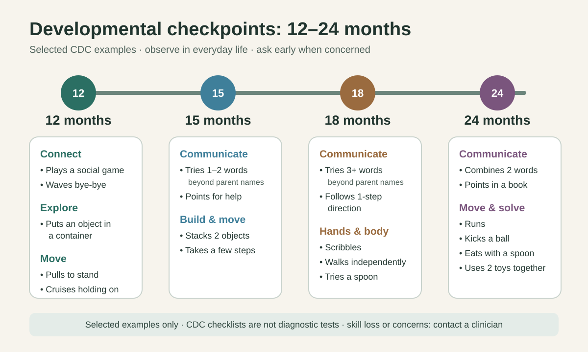

# Development: observe, support, and ask early

CDC checkpoints describe skills at least 75% of children can do by a given age. They support monitoring and discussion; they are not diagnostic tests or a score of intelligence. The selections below are brief examples, not the complete checklists. Open the linked CDC checklist at each checkpoint for official photos and videos. For a dedicated set of real example photos and videos, use the CDC photo and video library for [12 months](https://www.cdc.gov/act-early/milestones-in-action/1-year.html), [15 months](https://www.cdc.gov/act-early/milestones-in-action/15-months.html), [18 months](https://www.cdc.gov/act-early/milestones-in-action/18-months.html), and [2 years](https://www.cdc.gov/act-early/milestones-in-action/2-years.html).

## At 12 months

Examples include playing a social game, waving, putting an object into a container, pulling to stand, and moving along furniture while holding on. [Full CDC 1-year checklist with official media](https://www.cdc.gov/act-early/milestones/1-year.html)

## At 15 months

Examples include attempting one or two words beyond parental names, requesting help by pointing, taking a few independent steps, and stacking two objects. [Full CDC 15-month checklist with official media](https://www.cdc.gov/act-early/milestones/15-months.html)

## At 18 months

Examples include attempting at least three words beyond parental names, following a single spoken instruction without a gesture, walking independently, and making scribbles. [Full CDC 18-month checklist with official media](https://www.cdc.gov/act-early/milestones/18-months.html)

## At 24 months

Examples include combining at least two words, running, kicking a ball, and eating with a spoon. [Full CDC 2-year checklist with official media](https://www.cdc.gov/act-early/milestones/2-years.html)

## Between checkpoints

Write a natural example when you notice something new: date, setting, what the child did, and whether you helped. Use “seen,” “emerging,” or “not yet observed”; an unobserved skill is not automatically absent. Ask other caregivers what they see. Avoid daily testing or pressuring the child to demonstrate.

There are no separate CDC checklists for 13, 14, 16, 17, or 19–23 months. Those pages offer flexible play themes without assigning new milestone deadlines. Discuss missing milestones, skill loss, or any concern promptly with the child's clinician. A reassuring activity log cannot rule out a developmental difficulty.

For a child born prematurely or with a medical or developmental condition, ask the clinician how to interpret age and adapt activities. Use the [observation template](../templates/milestone-observation.md) to prepare for that discussion.
