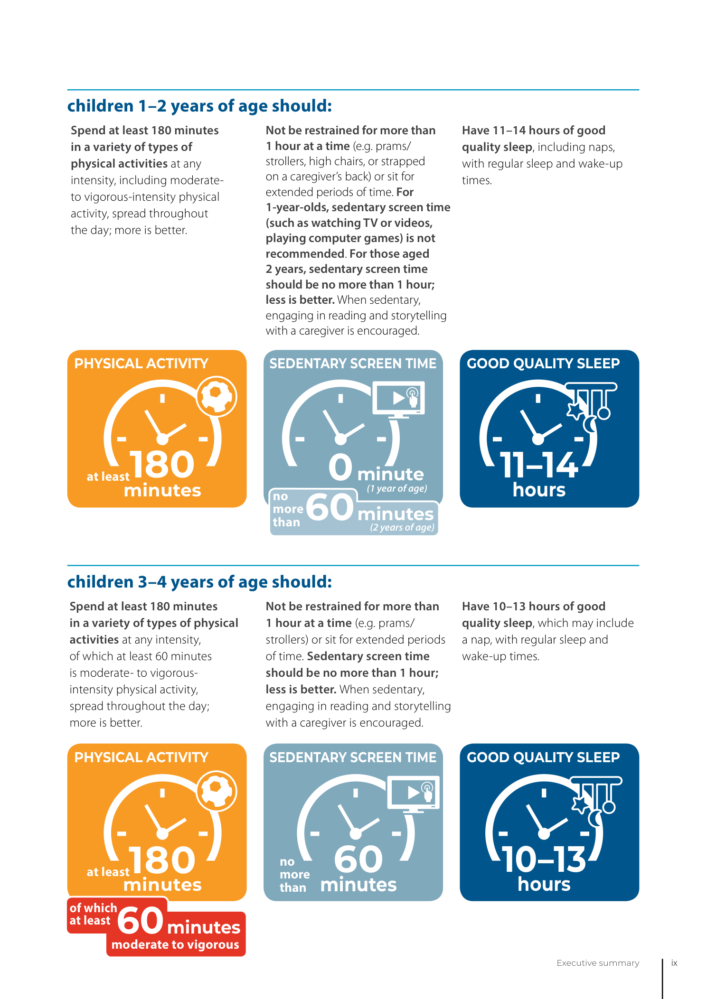

# Visual guides: what they show and what they do not

The repository graphics are original vector summaries created from the cited official guidance, plus one official WHO infographic reproduced under its license. They are designed to be readable, reusable, and free of a child's identifying photos.

## Developmental roadmap

The roadmap shows selected examples only. Milestones are not a race, and the drawing does not show every skill. CDC's official pages include real photo and video examples:

- [12 months](https://www.cdc.gov/act-early/milestones/1-year.html) and its [photo and video library](https://www.cdc.gov/act-early/milestones-in-action/1-year.html)
- [15 months](https://www.cdc.gov/act-early/milestones/15-months.html) and its [photo and video library](https://www.cdc.gov/act-early/milestones-in-action/15-months.html)
- [18 months](https://www.cdc.gov/act-early/milestones/18-months.html) and its [photo and video library](https://www.cdc.gov/act-early/milestones-in-action/18-months.html)
- [24 months](https://www.cdc.gov/act-early/milestones/2-years.html) and its [photo and video library](https://www.cdc.gov/act-early/milestones-in-action/2-years.html)

The CDC checklists describe skills most children can do by each checkpoint and are not substitutes for validated developmental screening. Sitting and crawling are not assigned new deadlines in this 12–24 month toolkit; families with questions should use earlier CDC checklists and speak with a clinician.

## Food preparation guide

The drawings compare shapes and textures; they are not life-size. Preparation guidance comes from [CDC choking prevention](https://www.cdc.gov/infant-toddler-nutrition/foods-and-drinks/choking-hazards.html), [CDC tastes and textures](https://www.cdc.gov/infant-toddler-nutrition/foods-and-drinks/tastes-and-textures.html), and [AAP choking prevention](https://www.healthychildren.org/English/health-issues/injuries-emergencies/Pages/Choking-Prevention.aspx).

## Monthly activity cards

Each monthly plan includes one original card illustration of that month's theme and activity choices. All cards share the same limits: they show selected examples only, they are **not** diagnostic tools or validated age-specific programs, and the month assignment is a practical adaptation.

| Month | Card claims | Sources |
| --- | --- | --- |
| [12 months](../months/12-months.md) | Put one large block in a wide cup; connecting, containing, and moving | [CDC 1 year](https://www.cdc.gov/act-early/milestones/1-year.html) · [WHO](https://www.who.int/publications/i/item/97892400020986) · [AAP](https://www.healthychildren.org/English/family-life/power-of-play/Pages/the-power-of-play-how-fun-and-games-help-children-thrive.aspx) |
| [13 months](../months/13-months.md) | Drop, tip out, and repeat without making play a test | WHO · AAP |
| [14 months](../months/14-months.md) | "In," "out," "open," and "closed"; all cues are communication | WHO · AAP |
| [15 months](../months/15-months.md) | Stack 2 objects, take a few steps, try 1–2 words, point | [CDC 15 months](https://www.cdc.gov/act-early/milestones/15-months.html) · WHO · AAP |
| [16 months](../months/16-months.md) | Supervised water pour describing "more" and "empty" | WHO · AAP |
| [17 months](../months/17-months.md) | Nest containers; offer small help without taking over | WHO · AAP |
| [18 months](../months/18-months.md) | Scribbles, cause-and-effect toy, rolling a ball; simple choices | [CDC 18 months](https://www.cdc.gov/act-early/milestones/18-months.html) · WHO · AAP |
| [19 months](../months/19-months.md) | Everyday pretend play with a doll and block home | WHO · AAP |
| [20 months](../months/20-months.md) | Big/small nesting cups and colors to explore, not sort | WHO · AAP |
| [21 months](../months/21-months.md) | Short, flexible turns of shared play; help with conflicts | WHO · AAP |
| [22 months](../months/22-months.md) | One simple shared project that may change direction | WHO · AAP |
| [23 months](../months/23-months.md) | Revisit water transfer and add one small variation | WHO · AAP |
| [24 months](../months/24-months.md) | Runs, kicks a ball, combines words; celebrate without comparing | [CDC 2 years](https://www.cdc.gov/act-early/milestones/2-years.html) · WHO · AAP |

Sources checked September 18, 2026; intended age range 12–24 months. Checkpoint-month cards echo selected CDC examples; other months show activity themes only, with CDC 15-, 18-, and 2-year checkpoints used for monitoring. See the [evidence register](../evidence/README.md) for source scope.

Each monthly plan also links the nearest official CDC photo and video library for real examples: checkpoint months link their own age; months between checkpoints link the two nearest ages because CDC publishes real milestone photos and videos only at 12, 15, 18, and 24 months.

## Official WHO 24-hour movement infographic

Rendered from the official WHO under-5 movement guidelines (2019), reproduced under the document's CC BY-NC-SA 3.0 IGO license. Source: [iris.who.int full text](https://www.who.int/publications/i/item/9789241550536), page 11; checked September 18, 2026. Claim illustrated: the 24-hour recommendations (physical activity, sedentary screen time, sleep) for ages 1–2 and 3–4. Intended age range: 1–4 years; the 1–2 year panel directly serves this 12–24 month toolkit, the 3–4 year panel is context only. Limitations: this is an official summary graphic, not diagnostic; screen-time and restraint statements apply per the source wording.

## Adding future images

For each new image, include the source URL, date checked, the exact claim illustrated, intended age range, and a sentence describing limitations. Prefer an original diagram linked to authoritative guidance. Do not copy a third-party photo unless its reuse license clearly permits repository redistribution and attribution requirements are met.
