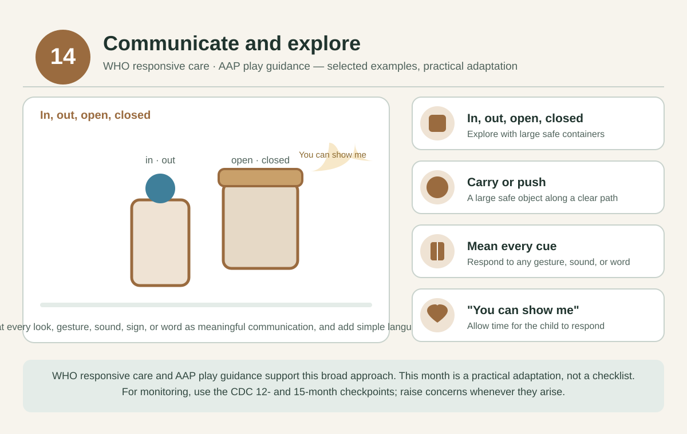

# 14 months — Communicate and explore

[Home](../README.md) · [Daily rhythm](../guides/routine.md) · [Activity instructions](../guides/activities.md)

**Activity theme only:** there is no separate CDC checklist for this month. Use the [12- and 15-month checkpoints](../guides/milestones.md) and raise concerns whenever they arise.

*Selected examples from the cited guidance, not a diagnostic test. See the [visual guide notes](../guides/visual-guides.md) and the [evidence register](../evidence/README.md).*

**Official real examples:** CDC publishes real milestone photos and videos only at its checkpoint ages; nearest are the [12-month library](https://www.cdc.gov/act-early/milestones-in-action/1-year.html) and the [15-month library](https://www.cdc.gov/act-early/milestones-in-action/15-months.html). There is no separate CDC media for this month.

## Parenting focus

Treat gestures, sounds, actions, signs, and words as meaningful communication. Join the child's chosen play and add simple language.

## Choose one invitation at a time

- **STEAM:** Explore “in,” “out,” “open,” and “closed” with large safe containers.
- **Art:** Make marks side by side on separate sheets; the adult models without requiring imitation.
- **Reading and language:** Point to a familiar picture and wait. Respond to any look, gesture, sound, or word.
- **Sports and movement:** Carry or push a large safe object along a clear floor path according to current ability.
- **Music:** Copy the child's rhythm, then add one new tap or movement.
- **Confidence and connection:** Say, “You can show me,” and allow time for the child to respond.

These are options across the month, not a daily checklist. Reconnect after childcare or separation and offer an activity only if the child is interested.

## Adjust to your child

Use fewer objects, slower pacing, and stable support. Stop before frustration becomes overwhelming and return to a familiar favorite. Follow the [safety notes](../guides/playroom.md).

## Health and observations

Collect a few natural examples of communication, movement, play, feeding, and sleep to discuss at the upcoming 15-month visit. Do not wait for that visit if a concern is present now.

**Reflection:** How does the child communicate “more,” “help,” “all done,” or an interesting discovery?

## Evidence and limits

[WHO responsive care](https://www.who.int/publications/i/item/97892400020986) and [AAP play guidance](https://www.healthychildren.org/English/family-life/power-of-play/Pages/the-power-of-play-how-fun-and-games-help-children-thrive.aspx) support the broad approach. This month's activity grouping is a practical adaptation, not a milestone standard.
