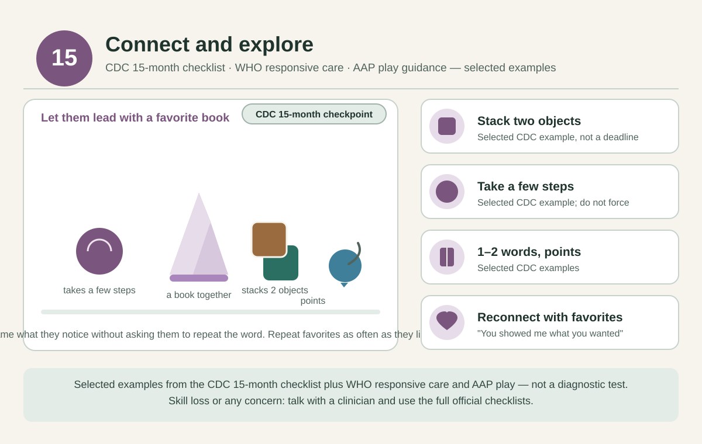

# 15 months — Connect and explore

[Home](../README.md) · [Daily rhythm](../guides/routine.md) · [Activity instructions](../guides/activities.md)

**Checkpoint month:** use the [full CDC checklist](https://www.cdc.gov/act-early/milestones/15-months.html), alongside clinician advice.

*Selected examples from the cited guidance, not a diagnostic test. See the [visual guide notes](../guides/visual-guides.md) and the [evidence register](../evidence/README.md).*

**Official real examples:** the [CDC photo and video library for 15 months](https://www.cdc.gov/act-early/milestones-in-action/15-months.html) shows actual children doing selected milestones; use it alongside the full checklist.

## Parenting focus

Let them lead with a familiar book, then join their chosen play. Make room for repeating the same action.

## Choose one invitation at a time

- **STEAM:** Put a large block into a wide container and tip it out together. Say “in” and “out”; wait for their next move.
- **Art:** Offer one large age-rated crayon and steady the paper. If they mouth it, put it away and try another activity.
- **Reading and language:** Look at one favorite picture together. Name what they notice without asking them to repeat the word.
- **Sports and movement:** Roll a soft ball on the floor. If they are walking, let them carry it a short distance; otherwise play seated.
- **Music:** Copy their claps or taps, then sing a familiar song.
- **Confidence and connection:** “You showed me what you wanted.” Respond to their pointing, sounds, and attempts to communicate.

These are options across the month, not a daily checklist. After childcare or a busy day, reconnect first and offer an activity only if they are interested. Repeat favorites as often as they like.

## Adjust to your child

Make it easier by reducing the materials, steadying an object, or participating while seated. Add only one small variation when they are engaged. Stop for tiredness, distress, refusal, or unsafe mouthing. Follow the [material, water, and movement safety notes](../guides/playroom.md); an adult stays involved.

## Health and observations

Review the full 15-month CDC checklist now and bring questions to the child's clinician. Confirm nap and meal patterns across caregivers.

**Reflection:** Which familiar activity helped the child reconnect after separation or a busy day?

Record a brief natural example in the [observation template](../templates/milestone-observation.md). Missing milestones, loss of skills, or any concern should prompt a clinician discussion; do not wait for next month's page.

## Evidence and limits

[WHO responsive care](https://www.who.int/publications/i/item/97892400020986) and [AAP play guidance](https://www.healthychildren.org/English/family-life/power-of-play/Pages/the-power-of-play-how-fun-and-games-help-children-thrive.aspx) support the broad approach. These particular games and this month assignment are practical adaptations, not a validated age-specific program. See the [evidence register](../evidence/README.md) for source scope and the [health guide](../guides/health.md) for screening, feeding, and dental references.
