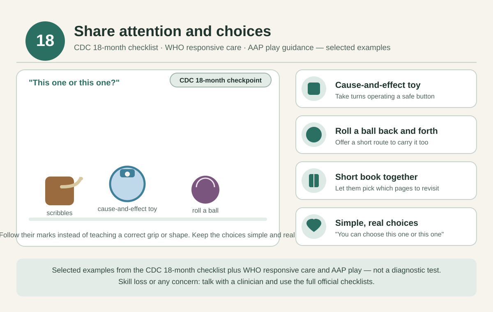

# 18 months — Share attention and small choices

[Home](../README.md) · [Daily rhythm](../guides/routine.md) · [Activity instructions](../guides/activities.md)

**Checkpoint month:** use the [full CDC checklist](https://www.cdc.gov/act-early/milestones/18-months.html), alongside clinician advice.

*Selected examples from the cited guidance, not a diagnostic test. See the [visual guide notes](../guides/visual-guides.md) and the [evidence register](../evidence/README.md).*

**Official real examples:** the [CDC photo and video library for 18 months](https://www.cdc.gov/act-early/milestones-in-action/18-months.html) shows actual children doing selected milestones; use it alongside the full checklist.

## Parenting focus

Enjoy play together while reviewing development with their clinician.

## Choose one invitation at a time

- **STEAM:** Explore a large age-rated cause-and-effect toy, taking turns operating a safe button or lever.
- **Art:** Set out paper and large crayons. Follow their marks instead of teaching a correct grip or shape.
- **Reading and language:** Choose a short book together and let them decide which pages to revisit.
- **Sports and movement:** Roll a ball back and forth, then offer a short clear route to carry it if they want.
- **Music:** Sing a familiar action song and model one simple movement.
- **Confidence and connection:** “You can choose this one or this one.” Keep the choices simple and real.

These are options across the month, not a daily checklist. After childcare or a busy day, reconnect first and offer an activity only if they are interested. Repeat favorites as often as they like.

## Adjust to your child

Make it easier by reducing the materials, steadying an object, or participating while seated. Add only one small variation when they are engaged. Stop for tiredness, distress, refusal, or unsafe mouthing. Follow the [material, water, and movement safety notes](../guides/playroom.md); an adult stays involved.

## Health and observations

Review the full 18-month CDC checklist. In US care, ask about general developmental and autism screening; local schedules may differ.

**Reflection:** What do they show you simply because it interests them?

Record a brief natural example in the [observation template](../templates/milestone-observation.md). Missing milestones, loss of skills, or any concern should prompt a clinician discussion; do not wait for next month's page.

## Evidence and limits

[WHO responsive care](https://www.who.int/publications/i/item/97892400020986) and [AAP play guidance](https://www.healthychildren.org/English/family-life/power-of-play/Pages/the-power-of-play-how-fun-and-games-help-children-thrive.aspx) support the broad approach. These particular games and this month assignment are practical adaptations, not a validated age-specific program. See the [evidence register](../evidence/README.md) for source scope and the [health guide](../guides/health.md) for screening, feeding, and dental references.
