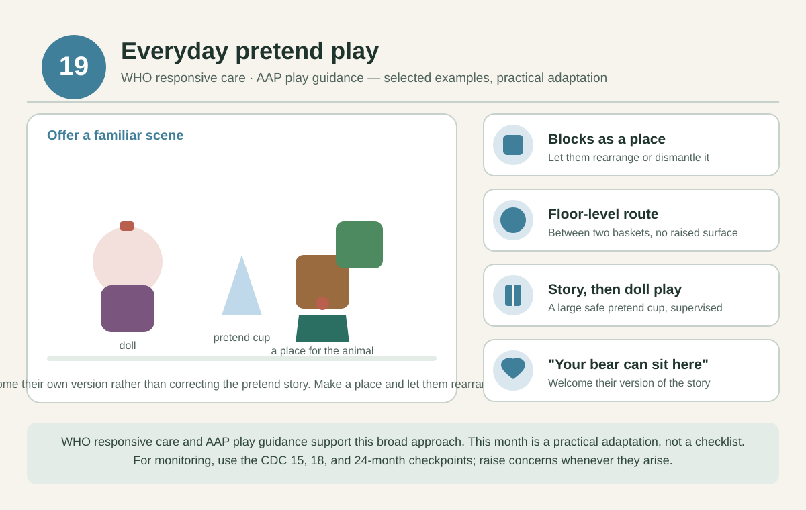

# 19 months — Everyday pretend play

[Home](../README.md) · [Daily rhythm](../guides/routine.md) · [Activity instructions](../guides/activities.md)

**Activity theme only:** there is no separate CDC checklist for this month. Use the [15, 18, and 24-month checkpoints](../guides/milestones.md) and raise concerns whenever they arise.

*Selected examples from the cited guidance, not a diagnostic test. See the [visual guide notes](../guides/visual-guides.md) and the [evidence register](../evidence/README.md).*

**Official real examples:** CDC publishes real milestone photos and videos only at its checkpoint ages; nearest are the [18-month library](https://www.cdc.gov/act-early/milestones-in-action/18-months.html) and the [2-year library](https://www.cdc.gov/act-early/milestones-in-action/2-years.html). There is no separate CDC media for this month.

## Parenting focus

Offer a familiar scene and see whether they want to imitate or change it.

## Choose one invitation at a time

- **STEAM:** Use large blocks to make a place for a toy animal. Let them rearrange or dismantle it.
- **Art:** Try washable age-appropriate paint with a large brush under close supervision; use water painting if they mouth tools or paint.
- **Reading and language:** After a story about food or bedtime, offer a doll and a large safe pretend cup.
- **Sports and movement:** Follow a floor-level route between two baskets, with no raised balancing surface.
- **Music:** Make up a short song about putting toys away and invite them to join.
- **Confidence and connection:** “Your bear can sit here.” Welcome their own version rather than correcting the pretend story.

These are options across the month, not a daily checklist. After childcare or a busy day, reconnect first and offer an activity only if they are interested. Repeat favorites as often as they like.

## Adjust to your child

Make it easier by reducing the materials, steadying an object, or participating while seated. Add only one small variation when they are engaged. Stop for tiredness, distress, refusal, or unsafe mouthing. Follow the [material, water, and movement safety notes](../guides/playroom.md); an adult stays involved.

## Health and observations

Notice whether transitions are harder when tired or hungry. Share a calming routine across caregivers.

**Reflection:** Which everyday routine do they like to copy?

Record a brief natural example in the [observation template](../templates/milestone-observation.md). Missing milestones, loss of skills, or any concern should prompt a clinician discussion; do not wait for next month's page.

## Evidence and limits

[WHO responsive care](https://www.who.int/publications/i/item/97892400020986) and [AAP play guidance](https://www.healthychildren.org/English/family-life/power-of-play/Pages/the-power-of-play-how-fun-and-games-help-children-thrive.aspx) support the broad approach. These particular games and this month assignment are practical adaptations, not a validated age-specific program. See the [evidence register](../evidence/README.md) for source scope and the [health guide](../guides/health.md) for screening, feeding, and dental references.
