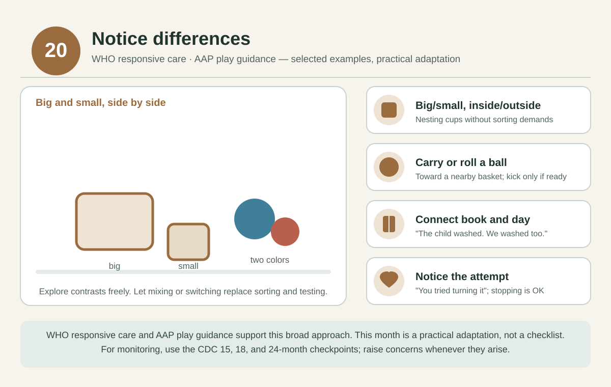

# 20 months — Notice differences

[Home](../README.md) · [Daily rhythm](../guides/routine.md) · [Activity instructions](../guides/activities.md)

**Activity theme only:** there is no separate CDC checklist for this month. Use the [15, 18, and 24-month checkpoints](../guides/milestones.md) and raise concerns whenever they arise.

*Selected examples from the cited guidance, not a diagnostic test. See the [visual guide notes](../guides/visual-guides.md) and the [evidence register](../evidence/README.md).*

**Official real examples:** CDC publishes real milestone photos and videos only at its checkpoint ages; nearest are the [18-month library](https://www.cdc.gov/act-early/milestones-in-action/18-months.html) and the [2-year library](https://www.cdc.gov/act-early/milestones-in-action/2-years.html). There is no separate CDC media for this month.

## Parenting focus

Explore contrasting materials or sizes without expecting them to sort or name them correctly.

## Choose one invitation at a time

- **STEAM:** Compare two large nesting cups or blocks: big/small, inside/outside. Let exploration replace testing.
- **Art:** Offer two paint colors or crayon colors; let them mix or switch freely.
- **Reading and language:** Describe an action in a book and connect it to their day: “The child is washing. We washed too.”
- **Sports and movement:** Try carrying or gently rolling a ball toward a nearby basket. Invite a kick only if comfortable.
- **Music:** Sing one verse slowly and another a little faster; let them move in their own way.
- **Confidence and connection:** Notice an attempt: “You tried turning it.” Let stopping be an acceptable choice.

These are options across the month, not a daily checklist. After childcare or a busy day, reconnect first and offer an activity only if they are interested. Repeat favorites as often as they like.

## Adjust to your child

Make it easier by reducing the materials, steadying an object, or participating while seated. Add only one small variation when they are engaged. Stop for tiredness, distress, refusal, or unsafe mouthing. Follow the [material, water, and movement safety notes](../guides/playroom.md); an adult stays involved.

## Health and observations

Review food preparation and seated supervision as the family menu changes. Keep hard, round, and small choking hazards out of reach.

**Reflection:** Which contrast caught their attention, even if they did not name it?

Record a brief natural example in the [observation template](../templates/milestone-observation.md). Missing milestones, loss of skills, or any concern should prompt a clinician discussion; do not wait for next month's page.

## Evidence and limits

[WHO responsive care](https://www.who.int/publications/i/item/97892400020986) and [AAP play guidance](https://www.healthychildren.org/English/family-life/power-of-play/Pages/the-power-of-play-how-fun-and-games-help-children-thrive.aspx) support the broad approach. These particular games and this month assignment are practical adaptations, not a validated age-specific program. See the [evidence register](../evidence/README.md) for source scope and the [health guide](../guides/health.md) for screening, feeding, and dental references.
